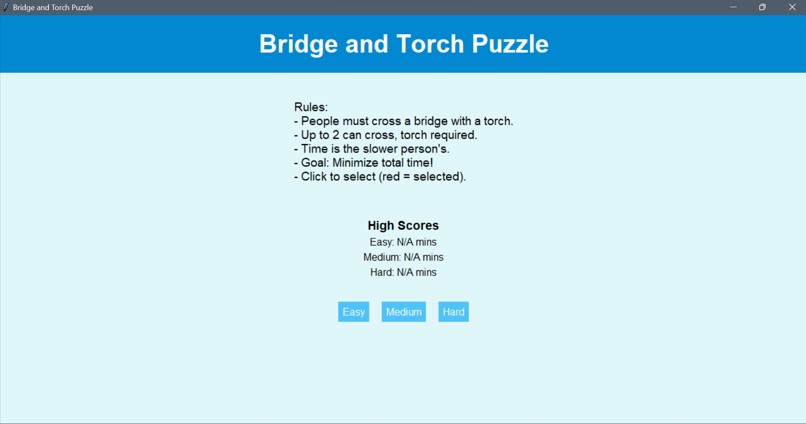
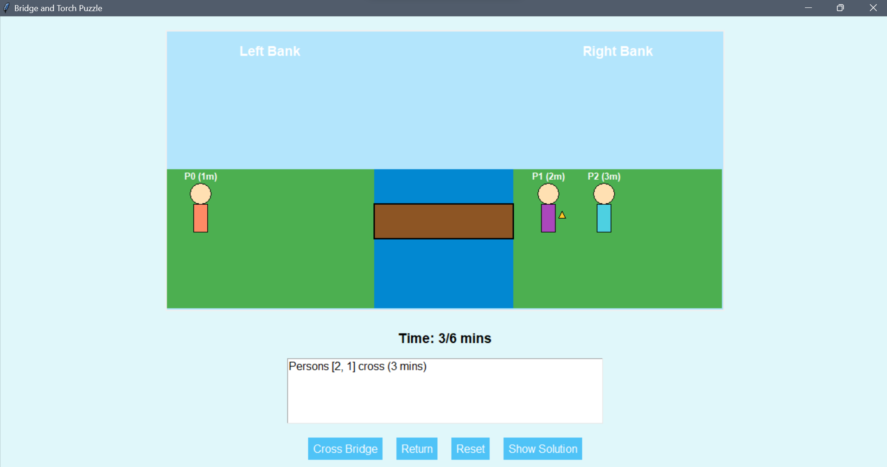
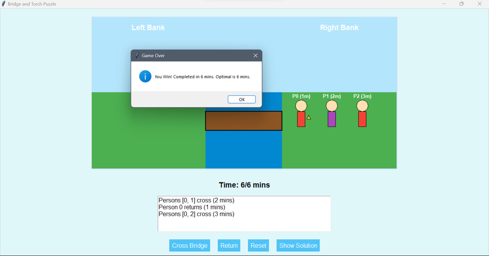

# Bridge and Torch Puzzle — AI-Powered Puzzle Game

An interactive, animated puzzle game implemented using **Python** and **Tkinter**, simulating the classic **Bridge and Torch Puzzle**. It combines engaging visuals, real-time feedback, and Artificial Intelligence (A* Search Algorithm) to guide users through problem-solving and optimization techniques.

---

## Project Overview

This project gamifies the well-known Bridge and Torch Puzzle, where players must move all individuals across a bridge with a torch under a strict time constraint. Only 1 or 2 people can cross at once, and the time is determined by the slower individual. The application features:

- Real-time animations and canvas interaction
- Multiple difficulty levels (Easy, Medium, Hard)
- AI-powered solution (A* Search Algorithm)
- Time tracking and move history
- Error handling for invalid moves
- High score system for replayability

---

## Game Rules

- The torch is required for any crossing.
- A maximum of 2 people can cross at a time.
- The crossing time is the **slowest person's** time.
- The goal is to cross all people in the **minimum total time**.

---

## 🧠 AI Integration — A* Search Algorithm

When the **"Show Solution"** button is clicked:
- The A* algorithm generates the optimal series of moves.
- It intelligently selects crossing-return combinations based on heuristics.
- The solution is animated to show the best possible way to win.

---

## 🛠️ Tech Stack

| Component     | Description                    |
|---------------|--------------------------------|
| Language      | Python 3.x                     |
| GUI Framework | Tkinter (Standard with Python) |
| Algorithm     | A* Search                      |
| Libraries     | heapq, itertools, time         |
| IDE           | PyCharm / VS Code              |
| OS            | Windows (recommended)          |

---

## 📦 Installation

1. **Clone the Repository**
   ```bash
   git clone https://github.com/yourusername/bridge-and-torch-puzzle.git
   cd bridge-and-torch-puzzle
   ```

2. **Install Dependencies**
   ```bash
   pip install -r requirements.txt
   ```

3. **Run the App**
   ```bash
   python version7.py
   ```

---

## 📸 Screenshots

### 🎬 Title Screen


### 🧩 Gameplay - Bridge Crossing


### 🧠 AI Solution


---

## 📄 License

This project is for educational purposes only.


